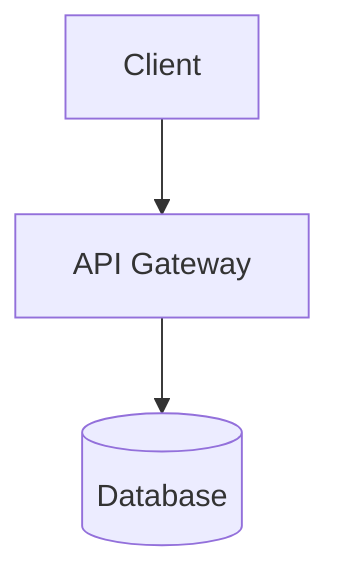
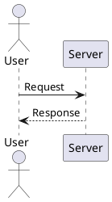

# md-tech-pdf

English | [日本語](./README.ja.md)

An open-source technical document PDF generator from Markdown with flexible, print-oriented diagram layout and vector typography.

Unlike conventional Markdown-to-PDF converters that treat diagrams as fixed raster images or apply crude page scaling, **md-tech-pdf** renders Mermaid and PlantUML diagrams as crisp vector SVGs with independent width and height control, custom aspect ratio fitting (`fit=contain` / `fill`), and alignment (`left` / `center` / `right`).

In addition to the standalone CLI and core library for automated documentation pipelines, an official [VS Code Extension](./vscode-extension) provides real-time print previews and direct PDF export within the editor.

---

## Features

- **VS Code Extension & Live Print Preview**: Real-time side-by-side print preview matching target paper dimensions with synchronized scrolling (Scroll Sync), sticky toolbar, scroll position preservation, and high-speed in-memory diagram caching.
- **Markdown to High-Quality Vector PDF**: Precise rendering engine built on headless Playwright Chromium.
- **Mermaid & PlantUML Support**: Inline vector SVG rendering for flowcharts, sequence diagrams, architecture maps, and class diagrams.
- **Independent Diagram Sizing**: Precise control over diagram `width` and `height` using real-world physical units (`mm`, `cm`, `in`) or digital units (`px`, `pt`, `%`).
- **Flexible Aspect Ratio & Alignment**: Choose between `fit=contain` (maintain aspect ratio) and `fit=fill`, aligned to `left`, `center`, or `right`.
- **YAML Front Matter**: Configure page format (A4), orientation (portrait/landscape), margins, fonts, and default diagram settings per document.
- **Font Customization**:
  - Local OS font support for body text (`family`) and code blocks (`codeFamily`).
  - Google Fonts integration via the CSS2 API with automatic loading completion detection.
- **Print-Ready Layout Optimizations**: Orphan heading prevention (`break-inside: avoid`), automated wrapping for long code lines, and multi-column table styling.
- **Developer-Friendly CLI**: Simple command-line interface with custom output paths, automatic directory creation, and versioning.

---

## Requirements

- **Node.js**: `>= 22.13.0`
- **Playwright / Chromium**: Required for PDF rendering (installed automatically with project dependencies).
- **Java Runtime & PlantUML JAR**: Required **only** if you render PlantUML diagrams. If you only use Mermaid diagrams, Java is **not** required.
- **Internet Connection**: Required **only** if downloading Google Fonts at compilation time (automatically falls back to system fonts when offline).

---

## Installation

Install globally via npm or pnpm to use the CLI command:

```bash
# Using npm
npm install -g md-tech-pdf

# Using pnpm
pnpm add -g md-tech-pdf
```

Alternatively, run directly without global installation using `npx`:

```bash
npx md-tech-pdf document.md -o output.pdf
```

---

## Quick Start & CLI Usage

### Basic Conversion

Convert a Markdown file to PDF. When omitted, the output file will be created in the same directory as the source Markdown file:

```bash
# Generates document.pdf in the current directory
md-tech-pdf document.md
```

### Specifying Output Path

Use `-o` or `--output` to define the destination file path. Non-existent directories are created automatically:

```bash
md-tech-pdf document.md -o output.pdf

# Auto-creates the build/ directory if missing
md-tech-pdf docs/architecture.md -o build/architecture.pdf
```

### Applying Custom Stylesheets

Inject one or more external CSS files into the generated document using `-s` or `--style`:

```bash
# Apply a single custom CSS file
md-tech-pdf document.md -s custom.css

# Apply multiple custom CSS files
md-tech-pdf document.md -s base.css brand.css -o output.pdf
```

### Custom PlantUML Paths and Cache Options

```bash
# Specify explicit Java binary and PlantUML JAR locations
md-tech-pdf document.md --java-path /usr/bin/java --plantuml-jar /opt/plantuml.jar

# Disable in-memory diagram rendering cache
md-tech-pdf document.md --no-cache
```

### Help and Version

```bash
# Show command-line help
md-tech-pdf --help
md-tech-pdf -h

# Show version number
md-tech-pdf --version
md-tech-pdf -v
```

---

## Document Configuration & Diagrams

### YAML Front Matter

Place Front Matter at the top of your Markdown document to customize PDF page margins, default diagram sizing, and typography:

```yaml
---
pdf:
  format: A4
  landscape: false
  margin:
    top: 20mm
    right: 20mm
    bottom: 20mm
    left: 20mm

diagram:
  width: 120mm
  height: 70mm
  fit: contain
  align: center

style:
  font:
    family: 'Noto Sans JP'
    codeFamily: 'Roboto Mono'
    google:
      families:
        - name: 'Noto Sans JP'
          weights: [400, 500, 700]
        - name: 'Roboto Mono'
          weights: [400, 700]
---
# System Architecture Specification
```

### Diagram Layout Options

You can customize individual diagram blocks using curly brace attributes `{...}` following the code block language identifier:

- `width`: Target width (supported units: `mm`, `cm`, `in`, `px`, `pt`, `%`).
- `height`: Target height (supported units: `mm`, `cm`, `in`, `px`, `pt`, `%`).
- `fit`: Scaling behavior (`contain` to preserve aspect ratio, or `fill` to stretch).
- `align`: Horizontal position (`left`, `center`, or `right`).

### Mermaid Diagrams

Specify `mermaid` as the code fence identifier. Diagrams are rendered as scalable vector SVGs directly embedded in the HTML:

````markdown

````

### PlantUML Diagrams

Specify `plantuml` as the code fence identifier. Rendering is executed locally via your system's Java runtime, ensuring confidential architecture designs are **never** transmitted to third-party PlantUML cloud servers:

````markdown

````

> **Note on PlantUML Prerequisites**:
> PlantUML requires a **Java runtime** and a local **PlantUML .jar file**. If necessary, specify custom paths in Front Matter:
>
> ```yaml
> plantuml:
>   javaPath: '/usr/bin/java'
>   jarPath: '/path/to/plantuml.jar'
> ```

### Font Configuration (style.font)

Configure document body text (`family`) and code block typography (`codeFamily`).

#### 1. Local OS Fonts

Use system fonts installed on the host machine. Fast, lightweight, and offline-compatible:

```yaml
style:
  font:
    family: 'Hiragino Sans'
    codeFamily: 'Menlo'
```

- Standard `sans-serif` is automatically appended to body text as a fallback.
- Standard `monospace` is automatically appended to code blocks (`code`, `pre`) as a fallback.

#### 2. Google Fonts

Download web fonts dynamically at build time using the Google Fonts CSS2 API:

```yaml
style:
  font:
    family: 'Noto Sans JP'
    codeFamily: 'Roboto Mono'
    google:
      families:
        - name: 'Noto Sans JP'
          weights: [400, 500, 700]
        - name: 'Roboto Mono'
          weights: [400, 700]
```

- Supported weights: `100, 200, 300, 400, 500, 600, 700, 800, 900`.
- The generator waits for `document.fonts.ready` before rendering PDF pages.
- If offline or on network failure, rendering gracefully falls back to system fonts.

---

## Examples

Explore sample Markdown documents and configuration patterns in the [examples/](./examples/) directory:

- [examples/real-world/system-design.md](./examples/real-world/system-design.md): A comprehensive system design document with Mermaid, PlantUML, custom fonts, and multi-column tables.
- [examples/frontmatter-test.md](./examples/frontmatter-test.md): Document-level margin and layout settings.
- [examples/mermaid-test.md](./examples/mermaid-test.md): Various Mermaid chart types and sizing attributes.
- [examples/plantuml-test.md](./examples/plantuml-test.md): PlantUML sequence and component diagrams.

---

## Architecture Overview

**md-tech-pdf** enforces a strict separation of concerns between client interfaces (CLI, future extensions) and the core conversion engine.

```text
+---------------------------------------+
|             Client Layer              |
|  +----------------+ +---------------+ |
|  |      CLI       | |  VSCode Ext   | |
|  |  (src/cli)     | |   (Future)    | |
|  +-------+--------+ +-------+-------+ |
+----------|------------------|---------+
           | (thin wrapper)   |
           v                  v
+---------------------------------------+
|              Core Layer               |
|            (src/index.ts)             |
|  - Markdown Parser                    |
|  - Diagram Engine (Mermaid/PlantUML)  |
|  - Layout Engine & PDF Generator      |
+---------------------------------------+
```

- **CLI (`src/cli/index.ts`)**: Thin command-line wrapper handling argument parsing and calling the Core API.
- **Core (`src/index.ts`)**: Standalone library handling document parsing, diagram execution, layout generation, and Playwright PDF printing.

---

## Node.js Library API

You can import and integrate **md-tech-pdf** directly into Node.js applications and build scripts:

```typescript
import { convertMarkdownToPdf } from 'md-tech-pdf';

const result = await convertMarkdownToPdf('docs/specification.md', {
  output: 'dist/specification.pdf',
  config: {
    style: {
      css: ['./theme/corporate.css'],
    },
    plantuml: {
      javaPath: '/usr/bin/java',
    },
  },
  onProgress: (event) => {
    console.log(`[${event.step}] ${event.message}`);
  },
});

console.log(`Generated: ${result.outputPath} (${result.bytes} bytes)`);
```

---

## Development

### Prerequisites

- Node.js `>= 22.13.0` (v24 LTS recommended)
- pnpm `>= 10.0.0` (v11 recommended)

### Setup

```bash
# Install dependencies
pnpm install
```

### Scripts

```bash
# Compile TypeScript to dist/
pnpm build

# Run unit and integration tests with Vitest
pnpm test

# Run ESLint static analysis
pnpm lint

# Check code formatting with Prettier
pnpm format:check

# Format codebase with Prettier
pnpm format
```

---

## Known Limitations

Current known limitations in the v0.4.0 release:

1. **Table Header Pagination (`<thead>`)**: Table headers do not repeat at the top of subsequent pages when a large table breaks across page boundaries.
2. **Pre-Diagram Whitespace for Tall Diagrams**: Very tall diagrams (>150mm) are moved to the next page to avoid cross-page diagram clipping (`break-inside: avoid`), which may leave whitespace at the bottom of the preceding page.
3. **PlantUML System Dependencies**: Rendering PlantUML requires a local Java runtime and PlantUML JAR file (Mermaid has no Java dependencies).
4. **Google Fonts Network Dependency**: Downloading Google Fonts requires an active internet connection at compilation time (falls back to local system fonts if unavailable).

---

## Changelog

Detailed release notes and version history are documented in [CHANGELOG.md](./CHANGELOG.md).

---

## Contributing

Contributions, issues, and feature requests are welcome! Please read [CONTRIBUTING.md](./CONTRIBUTING.md) for development setup and contribution guidelines. By participating, you agree to abide by our [Code of Conduct](./CODE_OF_CONDUCT.md).

---

## License

This project is licensed under the [Apache License 2.0](./LICENSE).
