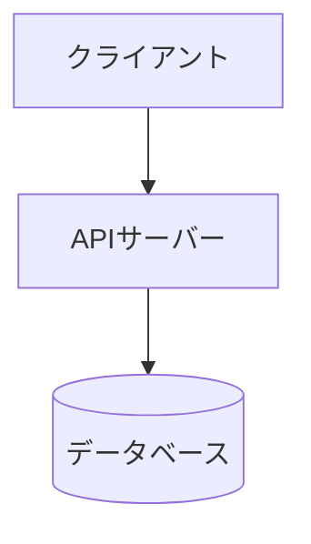
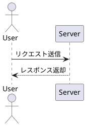

# md-tech-pdf

Markdownで作成した技術文書を、高品質なPDFへ変換するオープンソースツールです。

一般的なMarkdown PDF変換ツールとの差別化として、MermaidやPlantUMLなどのダイアグラム・図表をPDF向けに美しく、かつ柔軟にレイアウト・配置できることを目指しています。

将来的にはVSCode Extensionとしての提供も予定していますが、PDF生成コアロジックはCLIや特定のエディタ環境に依存しない独立した「Coreライブラリ」として設計されています。

---

## CLIの使い方

### 基本コマンド

Markdownファイルを指定してPDFへ変換します。

```bash
# 入力ファイルと同じディレクトリに document.pdf を生成
md-tech-pdf document.md
```

### 出力先パスの指定

`-o` または `--output` オプションで出力先PDFのファイルパスを指定できます。

```bash
md-tech-pdf document.md -o output.pdf
```

出力先ディレクトリが存在しない場合は、自動的に作成されます。

```bash
md-tech-pdf docs/architecture.md -o build/architecture.pdf
```

### ヘルプ・バージョン表示

```bash
# ヘルプの表示
md-tech-pdf --help
md-tech-pdf -h

# バージョンの表示
md-tech-pdf --version
md-tech-pdf -v
```

---

## ドキュメント設定とダイアグラム記述例

### YAML Front Matter設定

Markdownファイルの先頭にFront Matterを記述することで、文書全体のPDF余白や図の規定サイズを設定できます。

```yaml
---
pdf:
  format: A4
  landscape: false
  margin:
    top: 20mm
    right: 20mm
    bottom: 20mm
    left: 20mm

diagram:
  width: 120mm
  height: 70mm
  fit: contain
  align: center

style:
  font:
    family: 'Noto Sans JP'
    codeFamily: 'Roboto Mono'
    google:
      families:
        - name: 'Noto Sans JP'
          weights: [400, 500, 700]
        - name: 'Roboto Mono'
          weights: [400, 700]
---
# システム構成書
```

### フォント設定 (style.font)

文書の本文フォント（`family`）およびコードブロックフォント（`codeFamily`）を指定できます。

#### 1. ローカルフォントの指定

OSにインストールされているフォントを指定します。外部通信を行わずに高速かつオフラインで利用できます（実行環境に対象フォントがインストールされている必要があります）。

```yaml
style:
  font:
    family: 'Hiragino Sans'
    codeFamily: 'Menlo'
```

- 本文フォントのフォールバックとして自動的に `sans-serif` が付与されます。
- コード用フォント（`code`, `pre`）のフォールバックとして自動的に `monospace` が付与されます。

#### 2. Google Fonts の指定

Google Fonts CSS2 APIを利用してWebフォントを読み込み、本文およびコードフォントとして適用します（生成時に外部ネットワークアクセスが必要です）。

```yaml
style:
  font:
    family: 'Noto Sans JP'
    codeFamily: 'Roboto Mono'
    google:
      families:
        - name: 'Noto Sans JP'
          weights: [400, 500, 700]
        - name: 'Roboto Mono'
          weights: [400, 700]
```

- `weights` には `100, 200, 300, 400, 500, 600, 700, 800, 900` の標準weightを指定できます。
- PDF生成時は `document.fonts.ready` によりWebフォントのロード完了を待機してからレンダリングが行われます。
- オフライン時や通信障害時はタイムアウト後にフォールバックフォントを用いてPDF生成を継続します。

### Mermaidダイアグラム

フェンスブロックで `mermaid` を指定します。波括弧 `{}` で個別属性を指定でき、Front Matterの設定を上書き可能です。

````markdown

````

````

### PlantUMLダイアグラム

フェンスブロックで `plantuml` を指定します。

```markdown


---

## アーキテクチャ概要

本プロジェクトは関心事の分離を重視し、UI層（CLI、将来のエディタ拡張）とコアエンジン層を明確に分離しています。

### レイヤー構造

```

+---------------------------------------+
| Client Layer |
| +----------------+ +-------------+ |
| | CLI | | VSCode Ext | |
| | (src/cli) | | (Future) | |
| +-------+--------+ +------+------+ |
+-----------|------------------|--------+
| (thin wrapper) |
v v
+---------------------------------------+
| Core Layer |
| (src/index.ts) |
| - Markdown Parser |
| - Diagram Engine (Mermaid/PlantUML) |
| - Layout Engine & PDF Generator |
+---------------------------------------+

```

- **CLI (`src/cli/index.ts`)**: コマンドライン引数のパースとCore APIの呼び出しのみを担当します。PDF生成ロジックは記述しません。
- **Core (`src/index.ts`)**: ドキュメント解析、図のレンダリング、レイアウト調整、PDF出力など、すべての生成ロジックを集約する独立ライブラリです。

### ディレクトリ構成

```

md-tech-pdf/
├── .github/ # GitHub Actionsワークフローおよびテンプレート
├── docs/ # 設計資料・ドキュメント
├── examples/ # サンプルMarkdown文書・設定例
├── generated/ # 生成時の一時ファイル・出力先（.gitignore対象）
│ ├── cache/ # ダイアグラム等のキャッシュ
│ ├── diagrams/ # 生成された画像（SVG/PNG）
│ ├── html/ # 中間HTMLファイル
│ ├── pdf/ # 最終PDF出力
│ └── temp/ # その他作業用一時ファイル
├── src/ # ソースコード
│ ├── cli/ # CLIエントリーポイント
│ └── index.ts # Coreライブラリ エントリーポイント
├── test/ # テストコード
├── eslint.config.js # ESLint設定 (Flat config)
├── package.json # プロジェクト定義・依存関係
├── tsconfig.json # TypeScriptコンパイラ設定
└── vitest.config.ts # Vitestテストフレームワーク設定

````

---

## 開発方法

### 前提環境

- Node.js >= 24.0.0 (LTS: Krypton)
- pnpm >= 9.0.0

### セットアップ

```bash
# 依存関係のインストール
pnpm install
````

### スクリプト一覧

```bash
# TypeScriptのビルド (dist/ へ出力)
pnpm build

# Vitestによるユニットテストの実行
pnpm test

# ESLintによる静的解析
pnpm lint

# Prettierによるコードフォーマットチェック
pnpm format:check

# Prettierによるコード整形
pnpm format
```

---

## 今後のロードマップ

1. **フェーズ1: プロジェクト基盤の構築（完了）**
   - TypeScript, pnpm, ESLint, Prettier, Vitest による開発環境の構築
   - Core / CLI の分離アーキテクチャ定義

2. **フェーズ2: ドキュメント解析・中間HTML変換エンジンの実装**
   - Markdown解析および構文木（AST）処理
   - Front Matter解析とドキュメントメタデータ管理
   - テーマ・スタイルシート（CSS）適用機能

3. **フェーズ3: ダイアグラム連携とPDFレイアウト最適化**
   - Mermaid・PlantUMLコードブロックの抽出と画像生成
   - ページ分割（ページネーション）を意識した図表配置・サイズ自動調整
   - 図表のキャッシュ機構（`generated/cache/`）

4. **フェーズ4: Playwrightによる高品質PDF生成**
   - ヘッドレスブラウザを活用した高精度CSS Paged Mediaレンダリング
   - 目次、ヘッダー・フッター、ページ番号の動的生成

5. **フェーズ5: CLI機能の拡充**
   - 設定ファイル（JSON/YAML）対応
   - ファイル変更監視（Watchモード）とプレビュー機能

6. **フェーズ6: VSCode Extensionの開発**
   - リアルタイムプレビュー機能
   - ワンクリックPDFエクスポート
