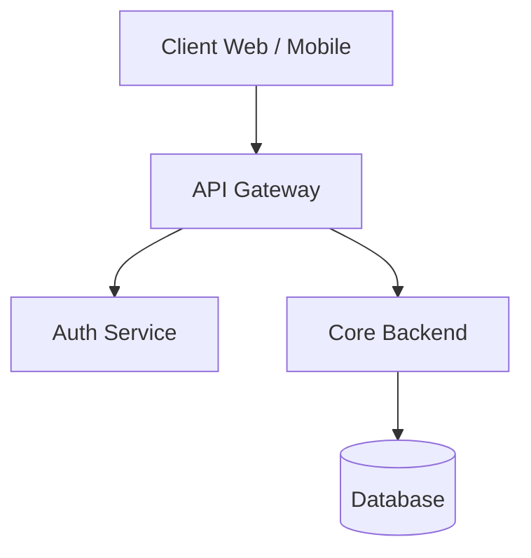

# Getting Started

`md-tech-pdf` is a technical document PDF generation toolkit designed for software engineers, architects, and technical writers.

## Key Features

- **Diagram First**: Native support for Mermaid and PlantUML diagrams with customizable width, height, alignment, and scale fitting.
- **Two Delivery Methods**: Use the command-line interface (`md-tech-pdf`) or the VS Code Extension (`md-tech-pdf`).
- **Typography & Aesthetics**: Embedded Google Fonts support, refined typography, and custom stylesheet injection.

## Installation

### CLI Tool

Install globally or as a project dependency:

```bash
npm install -g md-tech-pdf
# or with pnpm
pnpm add -g md-tech-pdf
```

### VS Code Extension

Search for `md-tech-pdf` in the Visual Studio Code Marketplace or open the command palette and type:

```text
ext install ikaruga.md-tech-pdf
```

## Quick Example

Create a file named `sample.md`:

````markdown
---
pdf:
  format: A4
  margin:
    top: 20mm
    bottom: 20mm
    left: 20mm
    right: 20mm
style:
  font:
    family: "'LINE Seed JP', sans-serif"
    google:
      families:
        - name: 'LINE Seed JP'
          weights: [400, 700]
---

# Technical Specification

## Architecture Overview


````

````

Convert it to PDF using the CLI:

```bash
md-tech-pdf sample.md
````

Your PDF `sample.pdf` will be created in the same directory.
