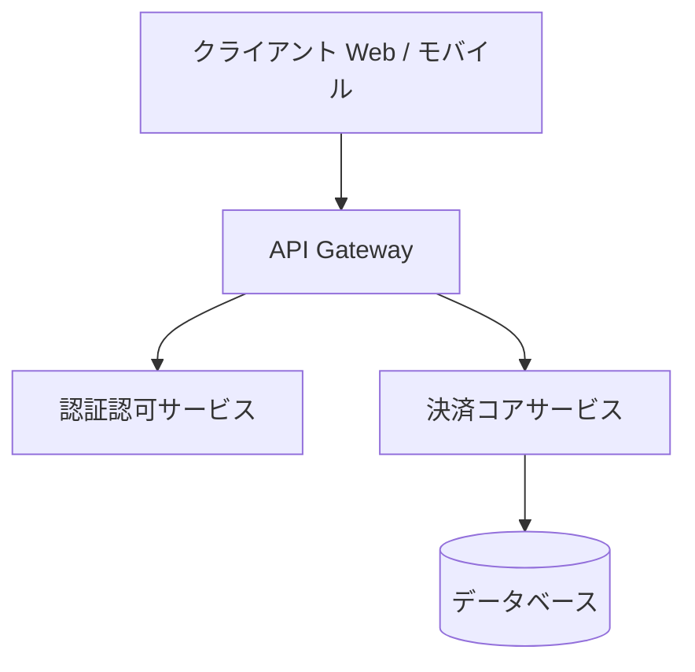

# スタートガイド

`md-tech-pdf` は、ソフトウェアエンジニア、アーキテクト、テクニカルライターのために設計された高品質な Markdown PDF 生成ツールキットです。

## 主な特長

- **ダイアグラム中心設計**: Mermaid および PlantUML をネイティブサポート。幅・高さ・配置（左/中央/右）・スケーリング（contain/fill）をコードブロック属性で自在に制御可能。
- **2つの利用形態**: コマンドラインツール（CLI）および VS Code 拡張機能の両方を提供。
- **美しいタイポグラフィ**: Google Fonts の自動読み込み、技術文書に最適化された余白と文字組み、カスタム CSS 注入に対応。

## インストール

### CLI ツール

グローバルまたはプロジェクトの開発依存としてインストールします:

```bash
npm install -g md-tech-pdf
# または pnpm
pnpm add -g md-tech-pdf
```

### VS Code 拡張機能

Visual Studio Code の拡張機能マーケットプレイスで `md-tech-pdf` を検索するか、コマンドパレットから以下を実行します:

```text
ext install ikaruga.md-tech-pdf
```

## クイックサンプル

`sample.md` を作成します:

````markdown
---
pdf:
  format: A4
  margin:
    top: 20mm
    bottom: 20mm
    left: 20mm
    right: 20mm
style:
  font:
    family: "'LINE Seed JP', sans-serif"
    google:
      families:
        - name: 'LINE Seed JP'
          weights: [400, 700]
---

# システムアーキテクチャ設計書

## 全体構成図


````

````

CLI で PDF へ変換します:

```bash
md-tech-pdf sample.md
````

同じディレクトリに高品質な `sample.pdf` が生成されます。
