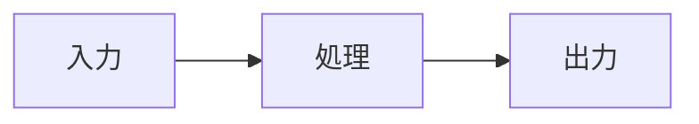
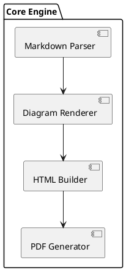

# ダイアグラム記法ガイド

`md-tech-pdf` は、Markdown 内の `mermaid` および `plantuml` フェンスコードブロックを自動検出してベクター SVG へ変換し、美しいレイアウトで文書へ埋め込みます。

## コードブロック属性の指定

フェンスのヘッダー部分に波括弧 `{...}` で属性を付与することで、ダイアグラムごとに個別のサイズや配置を制御できます:

````markdown

````

````

### サポートされている属性

| 属性名 | 指定可能な値 | 例 | 説明 |
| :--- | :--- | :--- | :--- |
| `width` | 単位付き長さ（`mm`, `cm`, `in`, `px`, `%`） | `width="120mm"`, `width="90%"` | ダイアグラムコンテナの横幅。 |
| `height` | 単位付き長さ（`mm`, `cm`, `in`, `px`） | `height="80mm"`, `height="400px"` | ダイアグラムコンテナの高さ上限。 |
| `fit` | `"contain"`, `"fill"` | `fit="contain"` | アスペクト比を維持するか（`contain`）、引き伸ばすか（`fill`）。 |
| `align` | `"center"`, `"left"`, `"right"` | `align="center"` | ページ上の水平配置（中央/左寄せ/右寄せ）。 |

## Mermaid サンプル

### シーケンス図

```mermaid
sequenceDiagram
    autonumber
    actor ユーザー
    participant アプリ
    participant サーバー

    ユーザー->>アプリ: ログインボタン押下
    アプリ->>サーバー: 認証リクエスト
    サーバー-->>アプリ: 200 OK (トークン返却)
    アプリ-->>ユーザー: ホーム画面表示
````

### クラス図

```mermaid
classDiagram
    class Animal {
      +String name
      +makeSound()
    }
    class Dog {
      +bark()
    }
    Animal <|-- Dog
```

## PlantUML サンプル

言語識別子に `plantuml` を指定します:

````markdown

````

```

```
