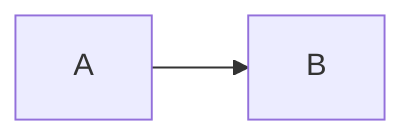
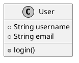

# Diagram Formatting Guide

`md-tech-pdf` natively detects and renders `mermaid` and `plantuml` fenced code blocks into scalable SVGs embedded directly into the HTML and PDF output.

## Code Block Attributes

Control dimensions, scale fitting, and alignment using attributes directly in the code block header:

````markdown

````

````

### Supported Attributes

| Attribute | Valid Values | Example | Description |
| :--- | :--- | :--- | :--- |
| `width` | Length with units (`mm`, `cm`, `in`, `px`, `%`) | `width="120mm"`, `width="90%"` | Container width for the diagram. |
| `height` | Length with units (`mm`, `cm`, `in`, `px`) | `height="80mm"`, `height="400px"` | Container height constraint. |
| `fit` | `"contain"`, `"fill"` | `fit="contain"` | Preserves aspect ratio (`contain`) or stretches (`fill`). |
| `align` | `"center"`, `"left"`, `"right"` | `align="center"` | Horizontal positioning on the page. |

## Mermaid Examples

### Sequence Diagram

```mermaid
sequenceDiagram
    Alice->>Bob: Hello Bob, how are you?
    Bob-->>Alice: I am good thanks!
````

### Flowchart

```mermaid
graph TD
    Start --> Check{Valid?}
    Check -- Yes --> Process[Execute Process]
    Check -- No --> Error[Log Error]
    Process --> End[Finish]
```

## PlantUML Examples

PlantUML blocks are enclosed using the `plantuml` language identifier:

````markdown

````

```

```
