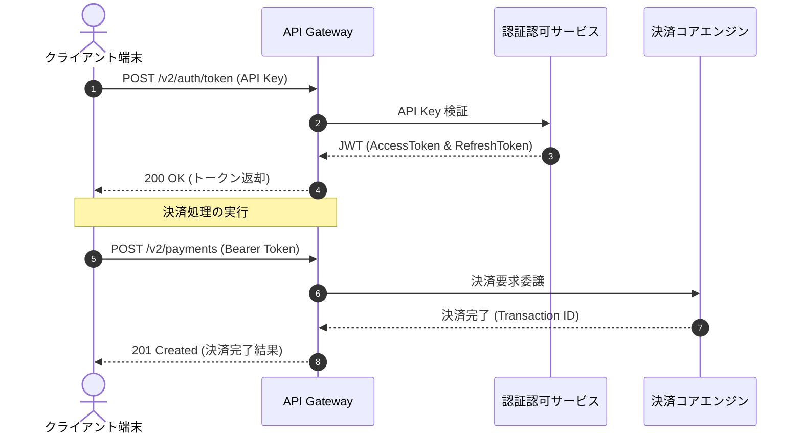

---
pdf:
  format: A4
  landscape: false
  margin:
    top: 20mm
    bottom: 20mm
    left: 20mm
    right: 20mm
style:
  font:
    family: "'LINE Seed JP', 'Noto Sans JP', sans-serif"
    codeFamily: "'Fira Code', monospace"
    google:
      families:
        - name: 'LINE Seed JP'
          weights: [400, 700, 800]
        - name: 'Fira Code'
          weights: [400, 500]
---

# 認証・決済 API 仕様書 (v2.4)

## 1. 概要

本ドキュメントは、外部クライアント向け「トークン発行および決済実行 API」のインターフェース仕様を定義するものです。すべての通信は HTTPS プロトコルを介して行われ、認証トークンとして JWT (JSON Web Token) を採用しています。

## 2. システム構成と認証フロー



## 3. エンドポイント一覧

| メソッド | パス                | 説明                                 | 認証    |
| :------- | :------------------ | :----------------------------------- | :------ |
| `POST`   | `/v2/auth/token`    | API Key を用いたアクセストークン発行 | API Key |
| `POST`   | `/v2/auth/refresh`  | リフレッシュトークンによる再認可     | Bearer  |
| `POST`   | `/v2/payments`      | 新規決済トランザクションの作成・決済 | Bearer  |
| `GET`    | `/v2/payments/{id}` | 決済状態・詳細情報の照会             | Bearer  |

## 4. 決済作成 API 仕様

### 4.1 リクエスト仕様

- URL: `/v2/payments`
- Method: `POST`
- Content-Type: `application/json`

```json
{
  "orderId": "ORD-2026-0927-001",
  "amount": 12800,
  "currency": "JPY",
  "paymentMethod": "credit_card",
  "customer": {
    "id": "CUST-98765",
    "email": "customer@example.com"
  }
}
```

### 4.2 レスポンス仕様

```json
{
  "transactionId": "TXN-884920491",
  "orderId": "ORD-2026-0927-001",
  "status": "completed",
  "amount": 12800,
  "currency": "JPY",
  "paidAt": "2026-09-27T18:00:00Z"
}
```
