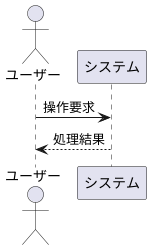
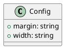

---
pdf:
  format: A4
  landscape: false
  margin:
    top: 20mm
    right: 20mm
    bottom: 20mm
    left: 20mm
diagram:
  width: 120mm
  height: 70mm
  fit: contain
  align: center
---

# Front Matter レンダリング検証テスト

本ドキュメントは、Markdown先頭のYAML Front Matterから取得した文書全体の設定（PDF余白、ダイアグラム既定サイズ）が反映されること、およびコードブロック個別指定との優先順位（個別指定 ＞ Front Matter ＞ 組み込みデフォルト）を検証するためのテスト文書です。

## 1. 文書設定の検証ポイント

- PDF余白: 上下左右 20mm（デフォルトの15mmから変更）
- ダイアグラム規定値: width=120mm, height=70mm, fit=contain, align=center
- 本文: YAML Front Matter ブロックがMarkdown本文へ漏れ出さずに非表示となること

## 2. Mermaid ダイアグラムの優先順位テスト

### 2.1 属性指定なし（Front Matter既定値: 120mm × 70mm, 中央揃えが適用）

### 2.2 個別属性で上書き（width=160mm, align=right が個別優先）

Front Matterの height=70mm と fit=contain を継承しつつ、width と align が上書きされます。

## 3. PlantUML ダイアグラムの優先順位テスト

### 3.1 属性指定なし（Front Matter既定値: 120mm × 70mm, 中央揃えが適用）

### 3.2 個別属性で上書き（width=80mm, align=left が個別優先）

