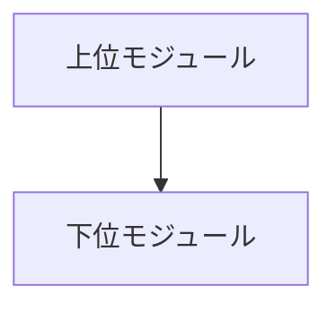
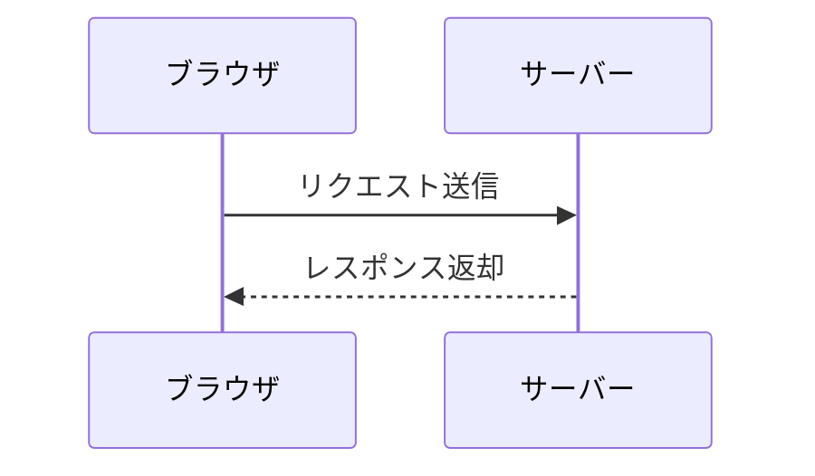
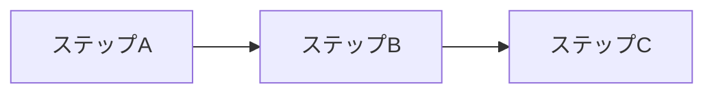

# HTML レンダリング総合テスト

本ドキュメントは、Markdown本文とMermaidダイアグラムのHTML変換、および各種オプション（width, height, fit, align）のレイアウト反映を目視確認するための総合テスト文書です。

## 1. 文章と装飾のテスト

これは通常の段落文章です。技術文書における**太字テキスト**や*イタリック表示*、[ハイパーリンク](https://example.com)が正しくスタイル付けされているか確認します。

> 引用文（Blockquote）のスタイル確認です。
> 複数行にわたる補足説明や注意書きが美しく枠線とともに装飾されます。

インラインの `const status = "success";` 記法も確認できます。

## 2. リストと表のテスト

箇条書きリスト:

- 第1の要件: ドキュメントの高品質な組版
- 第2の要件: MermaidダイアグラムのベクターSVG埋め込み
- 第3の要件: 柔軟な幅・高さ・配置指定

番号付きリスト:

1. Markdownファイルの解析
2. ダイアグラムブロックの抽出
3. ベクターSVGの生成
4. HTMLドキュメントの構築

仕様比較テーブル:

| 機能項目       | サポート状況 | 備考                                         |
| -------------- | ------------ | -------------------------------------------- |
| 見出し・段落   | 完全対応     | H1からH6まで階層構造を表現                   |
| リスト・表     | 完全対応     | 自動折り返しと境界線スタイル                 |
| Mermaid SVG    | 完全対応     | ベクター品質を保持したままインライン埋め込み |
| レイアウト指定 | 完全対応     | 幅・高さ・フィット・位置揃えを制御           |

## 3. 通常コードブロックのテスト

Mermaid以外のコードブロックは、通常のコードブロックとしてハイライト用クラス付きで保持されます。

```typescript
interface DocumentConfig {
  title: string;
  theme: 'default' | 'dark';
  enableDiagrams: boolean;
}

export function initialize(config: DocumentConfig): void {
  console.log(`Document initialized: ${config.title}`);
}
```

## 4. Mermaid ダイアグラムの各種属性テスト

### (1) 属性指定なし（デフォルト: 自然幅, fit=contain, align=center）


### (2) width のみ指定 (width=160mm)


### (3) height のみ指定 (height=60mm)



### (4) width + height 同時指定 (width=150mm height=70mm)



### (5) fit=contain の指定 (縦横比維持)


### (6) fit=fill の指定 (領域いっぱいへ引き伸ばし)



### (7) align=left (左寄せ配置)


### (8) align=center (中央配置)


### (9) align=right (右寄せ配置)


