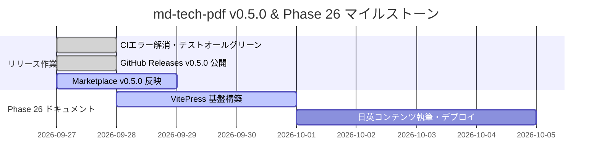

---
pdf:
  format: A4
  landscape: false
  margin:
    top: 15mm
    bottom: 15mm
    left: 15mm
    right: 15mm
style:
  font:
    family: "'LINE Seed JP', sans-serif"
    google:
      families:
        - name: 'LINE Seed JP'
          weights: [400, 700]
---

# プロジェクト定例ミーティング議事録

- 日時: 2026年9月27日 18:00 - 19:00
- 開催場所: オンライン（Google Meet）
- 参加者: 天城（進行・記録）、ご主人様（オーナー）

## 1. 議題一覧

1. md-tech-pdf v0.5.0 リリース進捗確認
2. GitHub Actions CI ワークフローの安定化実績
3. Phase 26 ドキュメントサイト（VitePress）ロードマップ

## 2. 決定事項

- VS Code 拡張機能 v0.5.0 および Core パッケージ v0.2.0 を正式公開ステータスへ移行する。
- ドキュメントサイトは VitePress を採用し、日本語と英語のバイリンガル対応を実施する。
- ドキュメントサイトの公開先は GitHub Pages とし、GitHub Actions で自動デプロイする。

## 3. リリースおよび公開スケジュール

## 4. アクションアイテム

| 担当     | タスク                                             | 期限       | ステータス |
| :------- | :------------------------------------------------- | :--------- | :--------- |
| 天城     | VitePress セットアップと GitHub Pages デプロイ構築 | 2026-09-30 | 進行中     |
| ご主人様 | Visual Studio Marketplace への最終確認と承認       | 2026-09-28 | 進行中     |
| 天城     | API 仕様書・議事録の PDF 出力確認                  | 2026-09-27 | 完了       |
