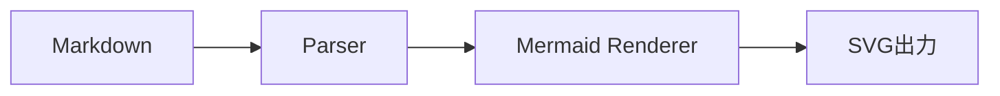
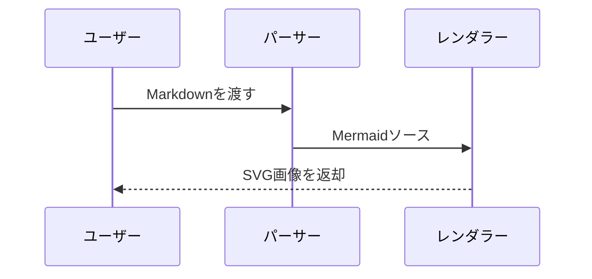

# Mermaid Test

通常のMarkdown文章です。

## Flowchart


```mermaid {width=160mm height=80mm fit=contain align=center}
flowchart LR
    A[Markdown] --> B[Parser]
    B --> C[Mermaid Renderer]
    C --> D[SVG出力]
```

## Sequence Diagram


```mermaid
sequenceDiagram
    participant User as ユーザー
    participant Parser as パーサー
    participant Renderer as レンダラー

    User->>Parser: Markdownを渡す
    Parser->>Renderer: Mermaidソース
    Renderer-->>User: SVG画像を返却
```

## 通常コード

```typescript
console.log('hello world');
```
