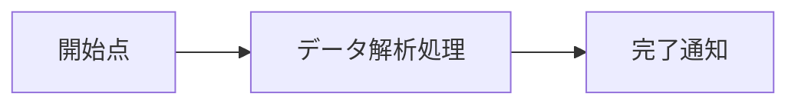
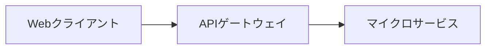
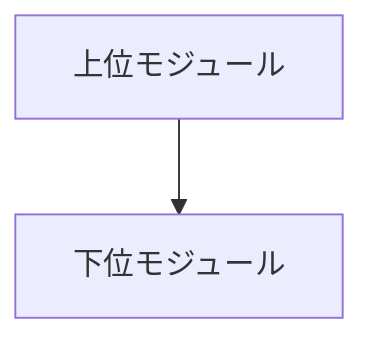
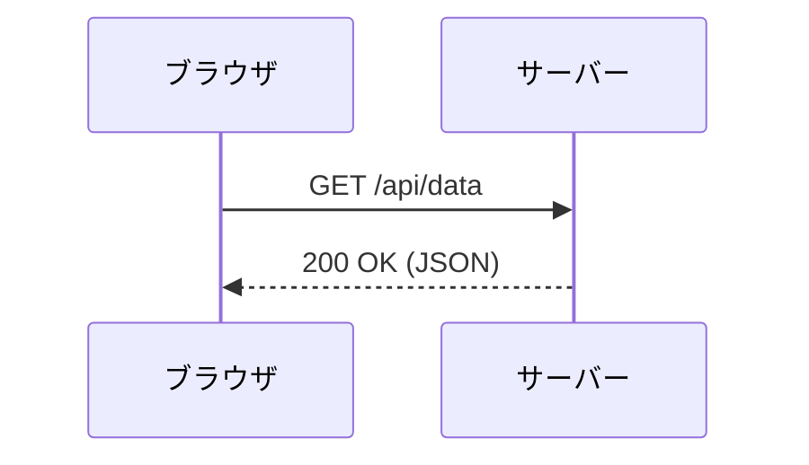
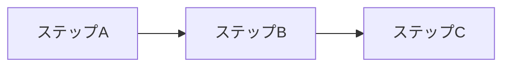
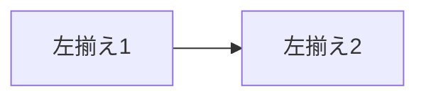
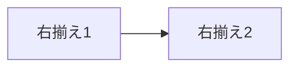
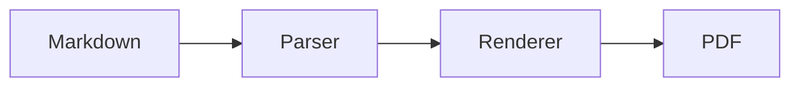
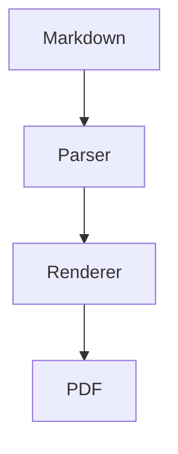

# PDF レンダリング総合検証テスト

本ドキュメントは、Markdown本文とMermaidダイアグラムがChromiumによってベクター品質のままA4サイズのPDFへ変換されること、および各種レイアウト属性（width, height, fit, align）の反映を目視確認するための総合テスト文書です。

## 1. 文章と装飾のテスト

これは通常の日本語段落文章です。技術文書における**太字テキスト**や*イタリック表示*、[サンプルリンク](https://example.com)が正しくスタイル付けされているか確認します。

### 1.1 引用文のスタイル確認

> 引用文（Blockquote）のスタイル確認です。
> 印刷時にも境界線と背景色が保持され、美しくレイアウトされます。

インラインコードの `const version = "0.1.0";` も正常に表示されます。

## 2. リストと表のテスト

箇条書きリスト:

- 第1要件: Markdown本文の正確なPDF化
- 第2要件: MermaidダイアグラムのベクターSVG埋め込み
- 第3要件: A4用紙およびマージン（上下左右15mm）の適用

番号付きリスト:

1. Markdownファイルの読み込み
2. HTML RendererによるHTML5文書の生成
3. Playwright ChromiumによるPDFへの印刷出力

仕様比較テーブル:

| 項目         | 設定値       | 期待される動作                                   |
| :----------- | :----------- | :----------------------------------------------- |
| 用紙サイズ   | A4           | 縦向き（portrait）で出力される                   |
| 余白         | 上下左右15mm | ドキュメントの四方に適切なマージンが確保される   |
| 背景印刷     | true         | 表のヘッダーやコードブロックの背景色が描画される |
| ベクター品質 | SVG保持      | 拡大してもダイアグラムが劣化せず鮮明に表示される |

## 3. 通常コードブロックのテスト

Mermaid以外のコードブロックは、通常のコードブロックとして等幅フォントと背景色付きで保持されます。

```typescript
interface DocumentPipeline {
  name: string;
  generatePdf(sourcePath: string, outputPath: string): Promise<void>;
}

export const pipeline: DocumentPipeline = {
  name: 'Playwright Chromium PDF Pipeline',
  async generatePdf(sourcePath: string, outputPath: string): Promise<void> {
    console.log(`Converting ${sourcePath} to ${outputPath}`);
  },
};
```

## 4. Mermaid ダイアグラムの各種属性テスト

### (1) 属性指定なし（デフォルト: 自然幅, fit=contain, align=center）



### (2) width のみ指定 (width=160mm)



### (3) height のみ指定 (height=60mm)



### (4) width + height 同時指定 (width=150mm height=70mm)



### (5) fit=fill (width=140mm height=40mm)



### (6) align=left (width=80mm)



### (7) align=right (width=80mm)



## 5. 特に重要な図サイズテスト

指示書で指定された2つの重要テストパターンです。

### 5.1 横長ダイアグラム (160mm × 50mm, fit=contain, align=center)



### 5.2 縦長ダイアグラム (80mm × 120mm, fit=contain, align=center)


