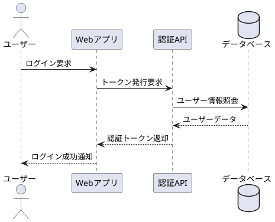
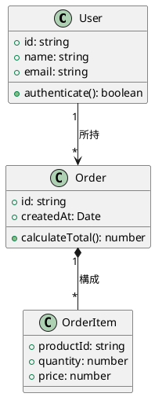
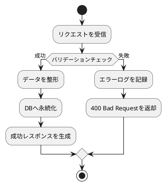

# PlantUML レンダリング検証テスト

本ドキュメントは、Markdown文書内のPlantUMLダイアグラム（シーケンス図、クラス図、アクティビティ図）がローカルのJavaプロセスおよび `plantuml.jar` を介してSVGへ変換され、HTMLおよびPDFへ正常に統合されることを検証するためのテスト文書です。

## 1. シーケンス図（属性指定あり: 幅・高さ・中央揃え）

ユーザー認証とデータ取得を行うシーケンス図です。日本語ラベルとレイアウト属性の反映を確認します。

## 2. クラス図（属性指定なし: 自然幅・デフォルト設定）

ユーザー管理および注文システムのクラス図です。属性指定を行わない場合のデフォルトレンダリングを確認します。

## 3. アクティビティ図（属性指定あり: 幅指定・左揃え）

業務プロセスの条件分岐とループを表現したアクティビティ図です。

