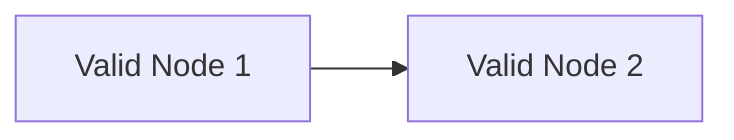

---
pdf:
  format: A4
  landscape: false
  margin:
    top: 15mm
    right: 15mm
    bottom: 15mm
    left: 15mm
---

# Diagram Preview Test Specification (Error Cases)

This document verifies graceful partial degradation and error UI containment when diagrams fail.

## Valid Mermaid Diagram Before Errors



## Broken Mermaid Diagram (Syntax Error)

```mermaid {width=140mm align=center}
flowchart TD
  This is a completely invalid syntax line that fails Mermaid parser %% broken!
```

## Valid Normal Markdown Content

Paragraph between broken diagrams: This paragraph must remain visible even if the preceding Mermaid diagram has an error.

- Feature item 1
- Feature item 2

## Broken PlantUML Diagram (Syntax Error)

```plantuml {width=140mm align=center}
@startuml
This is an invalid PlantUML syntax line that will fail execution
@enduml
```

## Valid Conclusion Section

Final paragraph verifying that normal technical documentation remains intact after multiple diagram errors.
