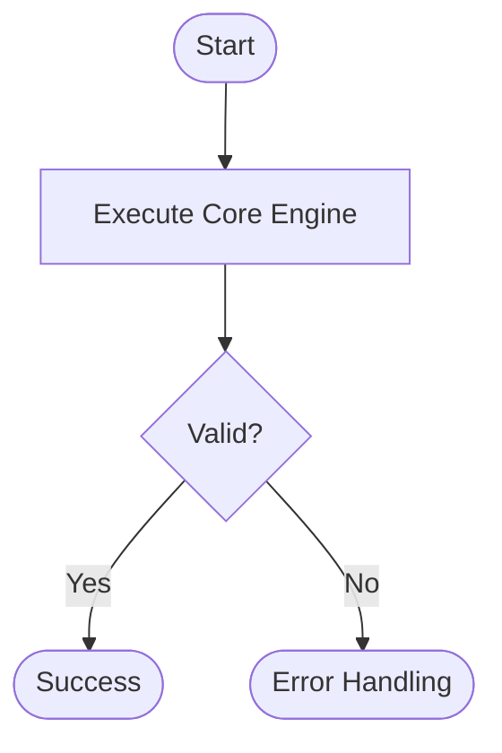
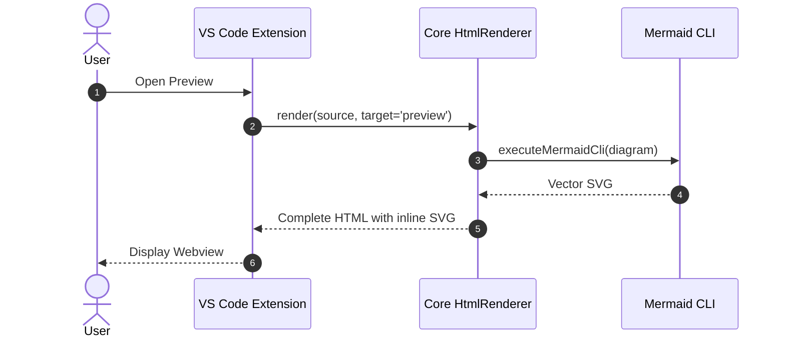
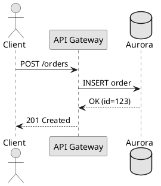
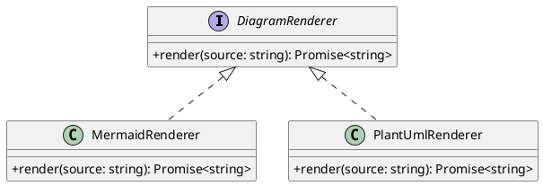

---
pdf:
  format: A4
  landscape: false
  margin:
    top: 15mm
    right: 15mm
    bottom: 15mm
    left: 15mm
diagram:
  fit: contain
  align: center
---

# Diagram Preview Test Specification (Success Cases)

This document verifies normal rendering and attribute alignment of Mermaid and PlantUML diagrams.

## Mermaid Flowchart

## Mermaid Sequence Diagram

## PlantUML Sequence Diagram

## PlantUML Class Diagram

