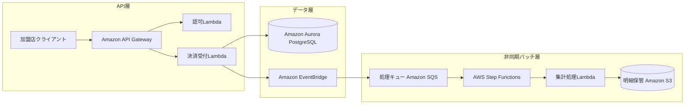
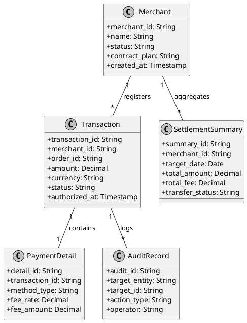
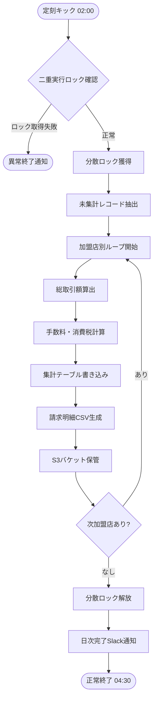
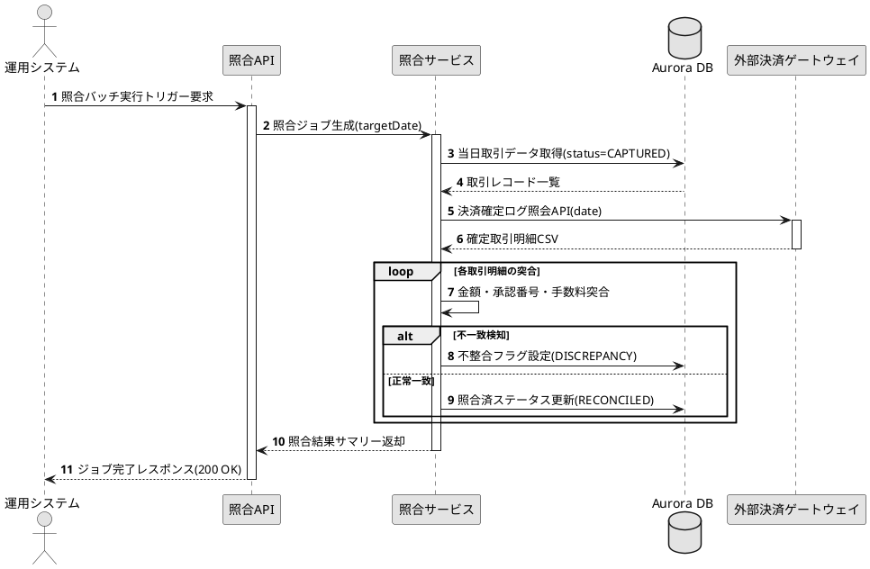
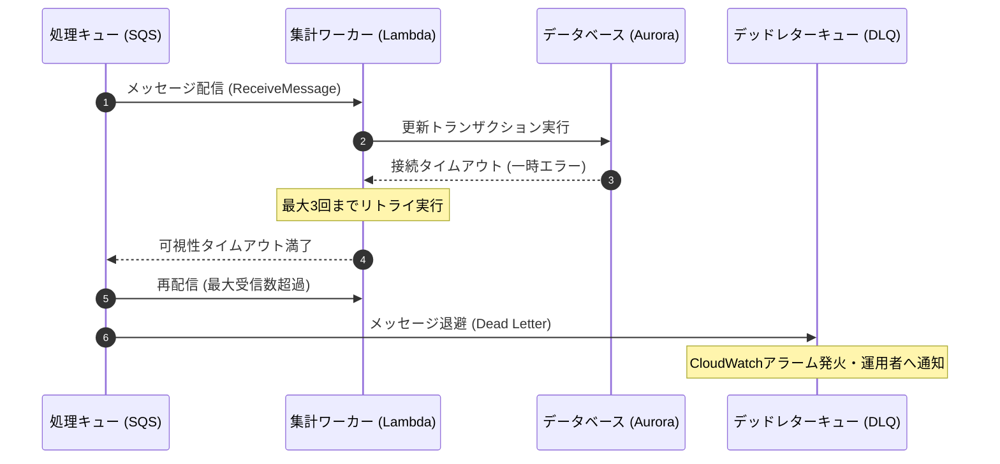
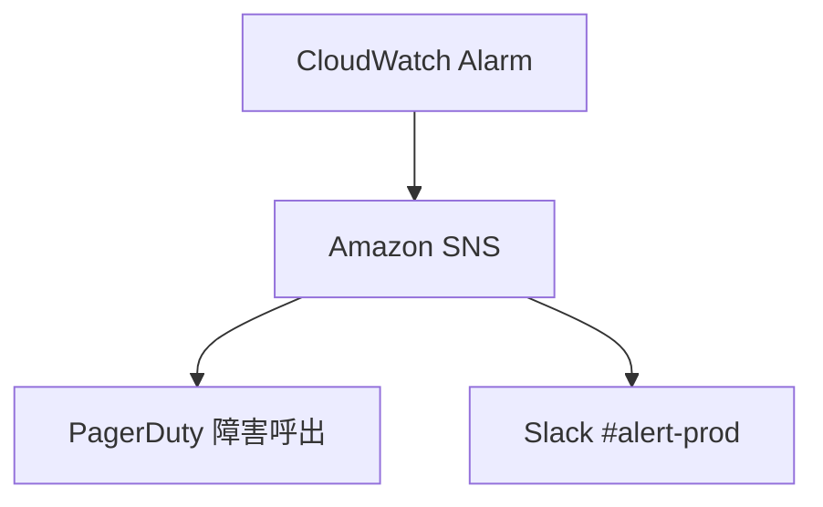
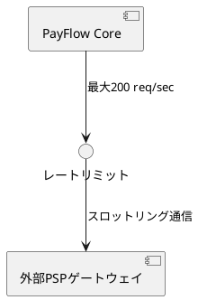

---
pdf:
  format: A4
  landscape: false
  margin:
    top: 5mm
    right: 5mm
    bottom: 5mm
    left: 5mm
diagram:
  fit: contain
  align: center
style:
  font:
    family: 'LINE Seed JP'
    codeFamily: 'Roboto Mono'
    google:
      families:
        - name: 'LINE Seed JP'
          weights: [400, 500, 700]
        - name: 'Roboto Mono'
          weights: [400, 700]
---

# システム設計書: クラウド型決済連携・請求集計基盤 (PayFlow Core)

本書は、マルチテナント型ECプラットフォームおよび外部決済ゲートウェイと連携し、日次・月次の請求明細集計を安全かつスケーラブルに実行するための決済データ連携・請求集計基盤「PayFlow Core」のシステム設計書です。

## 1. 概要

本章では、PayFlow Coreシステムの策定背景、目的、および設計上のスコープについて定義します。

### 1.1 背景と目的

近年、オンライン取引の急拡大に伴い、複数の決済代行事業者（PSP）や金融機関とのAPI連携トランザクションが指数関数的に増大しています。従来の単一リレーショナルデータベースと常駐デーモンによる同期バッチ処理では、ピーク時の負荷集中によるAPIタイムアウトや、深夜バッチの突き抜けリスクが顕在化していました。

本システムでは、高負荷に耐えうる同期Web API群と、イベント駆動型のサーバーレス非同期バッチ処理基盤を分離・統合することで、耐障害性と柔軟なスケーラビリティを両立した次世代決済インフラを構築することを目的とします。

### 1.2 対象範囲

本設計書が対象とする範囲は以下の通りです。

- 加盟店アプリケーションからの決済要求を受け付けるRESTful Web APIの設計
- 決済トランザクションログの永続化と即時検証機構
- イベント駆動による非同期決済通知受領および外部PSP照合パイプライン
- 大規模決済明細データの日次集計・請求締めバッチ処理アーキテクチャ
- 監査ログ、メトリクス収集、セキュリティ統制、および耐障害性設計

---

## 2. システム構成

本システムはAWS（Amazon Web Services）のマネージドサービスを主体として構築され、可用性と耐障害性を最大化する疎結合マルチAZ構成を採用しています。

### 2.1 全体システム構成図



上記のシステム構成図に示す通り、加盟店からのトランザクション要求はAPI Gatewayで受け付けられ、Aurora PostgreSQLへの確実な書き込みと同時にEventBridgeへイベントが送出されます。バッチ処理系はイベント駆動およびスケジュール駆動のStep Functionsによって疎結合にオーケストレーションされます。

### 2.2 主要コンポーネント一覧

本基盤を構成する主要なクラウドインフラコンポーネントの一覧を以下に示します。

| レイヤー     | サービス名               | 役割                                     | 冗長化方針                            | 備考                   |
| ------------ | ------------------------ | ---------------------------------------- | ------------------------------------- | ---------------------- |
| API受領      | Amazon API Gateway       | REST APIルーティング・スロットリング     | リージョン内マルチAZ自動分散          | Mutual TLS対応         |
| 認証認可     | AWS Lambda               | OAuth 2.0トークン検証・認可制御          | 複数AZ実行（コンカレンシー制御）      | Lambda Authorizer      |
| 同期処理     | AWS Lambda (Node.js)     | トランザクション受領・バリデーション     | プロビジョンド同時実行                | VPC内配置              |
| メインDB     | Amazon Aurora PostgreSQL | トランザクション原帳・加盟店情報管理     | Multi-AZ（プライマリ+リードレプリカ） | 自動フェイルオーバー   |
| 非同期連携   | Amazon EventBridge       | 業務イベントのルーティング・ファンアウト | マネージド高可用性                    | スキーマレジストリ連携 |
| 集計バッチ   | AWS Step Functions       | 日次請求集計ステートマシン制御           | マネージド分散実行                    | Express/Standard併用   |
| ファイル保管 | Amazon S3                | 請求書PDF・集計CSV・監査ログ保管         | 3AZ分散・イミュータブルロック         | オブジェクトロック有効 |

---

## 3. アーキテクチャ

本章では、高スループット同期処理と大量データ非同期バッチを安定動作させるためのアーキテクチャ詳細を規定します。

### 3.1 同期API処理パイプライン

同期API処理においては、クライアントに対する低レイテンシ応答（P99 < 300ms）を維持することが最重要課題です。API Gatewayでリクエストを受信した後、Lambda関数は必要最小限の事前検証とDBへの先行レコード挿入を行い、即座に受付完了レスポンスを返却します。

以降の重たい外部PSP通信や不正検知スコアリングは、内部イベントキューを経由して非同期ワーカーへ委譲されます。これにより、外部決済事業者の障害やレスポンス遅延が加盟店の購入導線へ波及するのを完全に遮断します。

### 3.2 非同期イベント駆動パイプライン

日次夜間に実行される請求明細集計バッチは、当日発生した数百万件の決済レコードを対象に、加盟店別の手数料計算および消費税計算を完了させる必要があります。

- EventBridge Schedulerから定刻（毎日深夜 02:00 JST）に集計キックイベントを発行します。
- Step Functionsが分散マップ（Distributed Map）を実行し、加盟店ID単位に並列分散処理を開始します。
- 一括集計結果はAuroraのサマリーテーブルへ反映され、同時にエクスポートCSVがS3へ出力されます。
- 万が一の処理失敗時は、デッドレターキュー（DLQ）へ退避されるとともに、運用者へアラート通知が行われます。

---

## 4. API設計

本基盤が加盟店および外部サービスへ提供するRESTful APIの仕様について定めます。

### 4.1 エンドポイント一覧

決済基盤として提供する標準エンドポイントは以下の通りです。

1. `POST /v1/transactions`: 新規決済トランザクションの作成
2. `GET /v1/transactions/{id}`: トランザクション詳細およびステータスの取得
3. `POST /v1/transactions/{id}/capture`: 売上確定処理の実行
4. `POST /v1/transactions/{id}/refund`: 返金・キャンセル処理の実行
5. `GET /v1/settlements/summaries`: 加盟店別請求サマリー照会

### 4.2 決済トランザクション作成API

#### 4.2.1 リクエスト仕様

決済トランザクションを作成する際のリクエストボディ形式（JSON）を以下に示します。

```json
{
  "merchantId": "mch_prod_99812401",
  "orderId": "ord_20260911_00019283",
  "amount": 12800,
  "currency": "JPY",
  "paymentMethod": {
    "type": "CREDIT_CARD",
    "token": "tok_secure_883a992bc4e1",
    "installments": 1
  },
  "customer": {
    "customerId": "usr_77123490",
    "email": "customer.sample@example.com",
    "ipAddress": "192.0.2.45"
  },
  "captureMode": "AUTOMATIC",
  "metadata": {
    "campaignCode": "AUTUMN_SALE_2026",
    "terminalBranch": "TOKYO_FLAGSHIP_STORE"
  }
}
```

#### 4.2.2 レスポンス仕様

処理が正常に受け付けられた場合、HTTP 201 Createdとともに一意のトランザクションIDが返却されます。

### 4.3 監査用コールバックおよび長大URL仕様

外部監査機関や分析プラットフォームとのデータ連携において、以下のようなリソース識別パスを含む長大なWebhookエンドポイントが利用されます。文書内におけるレイアウト折り返しの検証用URLとして記録します。

<https://example.com/api/v1/organizations/corp-global-payment-group-east/projects/proj-enterprise-settlement-system/resources/res-audit-log-collector-node-009/partitions/daily-transaction-partition-20260911/details>

---

## 5. データベース設計

本システムで扱う主要なエンティティ構造、リレーショナルテーブル定義、およびDDLを提示します。

### 5.1 ドメインエンティティクラス図



### 5.2 トランザクションテーブル物理定義書

横に長い表（8列）における印字および折り返しの検証用定義表です。

| 項目 | 論理名             | 物理名         | 型          | 桁数 | NULL | デフォルト        | 備考                             |
| ---- | ------------------ | -------------- | ----------- | ---- | ---- | ----------------- | -------------------------------- |
| 1    | トランザクションID | transaction_id | VARCHAR     | 64   | NO   | なし              | 主キー・UUIDv4形式               |
| 2    | 加盟店識別子       | merchant_id    | VARCHAR     | 32   | NO   | なし              | 外部キー（Merchantテーブル参照） |
| 3    | オーダー番号       | order_id       | VARCHAR     | 64   | NO   | なし              | 加盟店側管理の一意注文ID         |
| 4    | 決済決済金額       | amount         | NUMERIC     | 12,2 | NO   | 0.00              | 通貨単位に応じた小数点管理       |
| 5    | 取引通貨           | currency       | CHAR        | 3    | NO   | 'JPY'             | ISO 4217規格コード準拠           |
| 6    | 取引ステータス     | status         | VARCHAR     | 20   | NO   | 'PENDING'         | PENDING, AUTHORIZED, CAPTURED等  |
| 7    | 承認完了日時       | authorized_at  | TIMESTAMPTZ | -    | YES  | NULL              | 外部決済ゲートウェイ承認時刻     |
| 8    | 登録タイムスタンプ | created_at     | TIMESTAMPTZ | -    | NO   | CURRENT_TIMESTAMP | レコード物理作成日時             |

### 5.3 決済ステータスマスタ定義一覧

行数の多い表（全20行）におけるページまたぎ動作を検証するためのステータスコードマスタ一覧表です。

| No. | ステータスコード | 英語名称             | 日本語名称             | 遷移可能状態                   |
| --- | ---------------- | -------------------- | ---------------------- | ------------------------------ |
| 01  | INIT_REQUEST     | Initial Request      | リクエスト受領         | VALIDATING, REJECTED           |
| 02  | VALIDATING       | Parameter Validating | パラメータ検証中       | AUTH_REQUESTED, INVALID_FORMAT |
| 03  | INVALID_FORMAT   | Format Error         | 入力形式不正           | なし（終了状態）               |
| 04  | AUTH_REQUESTED   | Auth Requested       | PSP認証要求済          | AUTH_AUTHORIZED, AUTH_REJECTED |
| 05  | AUTH_AUTHORIZED  | Authorized           | 仮売上承認完了         | CAPTURING, VOIDING             |
| 06  | AUTH_REJECTED    | Card Rejected        | カード会社拒否         | なし（終了状態）               |
| 07  | CAPTURING        | Capturing            | 売上確定処理中         | CAPTURED, CAPTURE_FAILED       |
| 08  | CAPTURED         | Captured             | 売上確定完了           | REFUNDING, DISPUTED            |
| 09  | CAPTURE_FAILED   | Capture Failed       | 売上確定失敗           | CAPTURING, ABORTED             |
| 10  | VOIDING          | Voiding              | 仮売上取消中           | VOIDED, VOID_FAILED            |
| 11  | VOIDED           | Voided               | 仮売上取消完了         | なし（終了状態）               |
| 12  | VOID_FAILED      | Void Failed          | 取消失敗               | VOIDING, ESCALATED             |
| 13  | REFUNDING        | Refunding            | 返金処理中             | REFUNDED, REFUND_FAILED        |
| 14  | REFUNDED         | Refunded             | 返金完了               | なし（終了状態）               |
| 15  | REFUND_FAILED    | Refund Failed        | 返金失敗               | REFUNDING, ESCALATED           |
| 16  | DISPUTED         | Chargeback Disputed  | チャージバック異議申立 | SETTLED_LOSS, DISPUTE_WON      |
| 17  | DISPUTE_WON      | Dispute Won          | 異議申立勝訴           | CAPTURED                       |
| 18  | SETTLED_LOSS     | Settled Loss         | 損失確定               | なし（終了状態）               |
| 19  | ESCALATED        | Operator Escalated   | オペレータ調査中       | RESOLVED, ABORTED              |
| 20  | ARCHIVED         | Archived             | 監査ログ保管済         | なし（永続終了状態）           |

### 5.4 テーブルDDL定義

トランザクションテーブル作成用のDDL文を以下に示します。

```sql
CREATE TABLE payment_transactions (
    transaction_id VARCHAR(64) NOT NULL,
    merchant_id VARCHAR(32) NOT NULL,
    order_id VARCHAR(64) NOT NULL,
    amount NUMERIC(12, 2) NOT NULL DEFAULT 0.00,
    currency CHAR(3) NOT NULL DEFAULT 'JPY',
    status VARCHAR(20) NOT NULL DEFAULT 'PENDING',
    idempotency_key VARCHAR(128) NOT NULL,
    authorized_at TIMESTAMP WITH TIME ZONE,
    created_at TIMESTAMP WITH TIME ZONE NOT NULL DEFAULT CURRENT_TIMESTAMP,
    updated_at TIMESTAMP WITH TIME ZONE NOT NULL DEFAULT CURRENT_TIMESTAMP,
    CONSTRAINT pk_payment_transactions PRIMARY KEY (transaction_id),
    CONSTRAINT uk_payment_idempotency UNIQUE (merchant_id, idempotency_key)
);

CREATE INDEX idx_transactions_merchant_date ON payment_transactions (merchant_id, created_at DESC);
```

---

## 6. バッチ処理設計

日次夜間に実行される請求締め処理および外部決済照合のバッチ処理設計について説明します。

### 6.1 日次請求集計バッチフロー

縦長のダイアグラム（90mm × 160mm）を用いたバッチ実行フロー図です。



### 6.2 外部決済機関照合シーケンス図

決済確定データと外部機関データを照合する際の相互通信シーケンスを以下に示します。



---

## 7. エラー処理

本基盤における例外処理、再試行戦略、および耐障害性設計を規定します。

### 7.1 エラーハンドリング方針

APIおよびバッチ処理における例外は、再試行可能な「一時的エラー（Transient Error）」と、再試行不可能な「恒久的エラー（Permanent Error）」に厳格に分類されます。一時的エラー（DB接続プール枯渇、外部PSPの503応答など）は指数バックオフ（Exponential Backoff with Full Jitter）を伴う自動再試行を行い、恒久的エラー（認証失敗、パラメータ不正）は即座に中断して呼出元へ返却します。

### 7.2 リトライおよびデッドレターキュー制御

非同期キューにおける再試行とデッドレターキュー（DLQ）への退避シーケンス図です。



---

## 8. ログ設計

監査対応および障害追跡を迅速に行うための構造化ログ（JSON Lines形式）の仕様を定義します。

### 8.1 構造化ログフォーマット

すべてのアプリケーションログには、リクエストID、テナントID、実行コンテキストが含まれます。

### 8.2 TypeScript型定義

構造化ログの型定義および意図的な超長大行を含む実装コードです。

```typescript
export interface StructuredLogContext {
  traceId: string;
  spanId: string;
  merchantId: string;
  environment: 'development' | 'staging' | 'production';
  timestamp: string;
}

export interface PaymentAuditLogPayload {
  eventName: 'PAYMENT_AUTHORIZED' | 'PAYMENT_CAPTURED' | 'PAYMENT_REFUNDED';
  transactionId: string;
  amount: number;
  currency: string;
  maskedCardNumber: string;
  riskScore: number;
  durationMs: number;
  endpointUrl: string;
}

export class StructuredLogger {
  constructor(private readonly context: StructuredLogContext) {}

  public info(event: PaymentAuditLogPayload): void {
    const record = {
      ...this.context,
      level: 'INFO',
      ...event,
      // 意図的な極長行のレイアウトはみ出し検証用コード
      diagnosticSignature: `PAYFLOW_VERIFICATION_TOKEN_SHA256_EXTENDED_TRACE_STRING_0123456789ABCDEF_FOR_PDF_LAYOUT_BOUNDARY_TESTING_PURPOSE_ONLY_EXTRA_LONG_STATEMENT_CHAIN_${this.context.merchantId}_${event.transactionId}`,
    };
    process.stdout.write(`${JSON.stringify(record)}\n`);
  }
}
```


---

## 9. セキュリティ

金融取引を扱うシステムとして、PCI DSS要件および各国の暗号化標準に準拠したセキュリティアーキテクチャを採用します。

### 9.1 認証・認可アーキテクチャ

すべてのAPIエンドポイントは、OAuth 2.0 Client Credentials Grantによる相互認証が必須となります。加盟店クライアントにはプライベートキーJWTによる認証が課され、発行されたアクセストークン（有効期限15分）はAPI GatewayのカスタムAuthorizerによりキャッシュ検証されます。

### 9.2 通信およびデータ暗号化

- 転送中データ: すべての外部および内部通信はTLS 1.3により暗号化されます。非推奨の暗号スイート（CBCモード等）はロードバランサー層で遮断されます。
- 静止中データ: Auroraストレージ、S3バケット、SQSキューは、AWS KMS（Key Management Service）の顧客管理キー（CMK）によってAES-256で自動暗号化されます。カード番号等の機密情報はトークン化基盤（Tokenization Vault）に隔離され、アプリケーション層にはマスキング済みデータのみが流通します。

---

## 10. 非機能要件

本システムの可用性、性能、運用性に関する目標指標および達成方針を定義します。

### 10.1 性能目標指標

- API応答速度: 通常時 P50 < 80ms, P99 < 300ms（外部PSP通信時間を除く）
- 最大スループット: 平常時 500 TPS, ピークセール時 3,000 TPS
- バッチ処理能力: 500万件の決済明計データを2.5時間以内に集計完了

### 10.2 可用性と事業継続性（BCP）

マルチAZ自動フェイルオーバー構成により、単一データセンター障害時もRPO（目標復旧時点）= 0、RTO（目標復旧時間）< 60秒で業務を継続します。日次スナップショットは別リージョン（大阪リージョン）へ自動クロスリージョンレプリケーションされます。

### 10.3 3階層リストによる運用許容基準

本システムにおけるSLAおよび運用許容基準を以下に示します。

- 稼働率保証（月間 99.95% 以上）
  - 計画停止メンテナンス
    - 月1回以内、深夜時間帯（03:00 - 05:00 JST）に限定
    - 実施の14日前までに全加盟店へアナウンス完了
  - 計画外障害停止
    - 単一インシデントの最大許容停止時間: 20分以内
    - 月間累計障害時間: 21分36秒以内
- データ整合性保証
  - 取引データの欠損率: 0.00000%（ゼロ欠損）
  - 外部決済データとの不整合差分
    - 自動検知後の一次隔離: 即時（1分以内）
    - オペレータによる原因究明着手: 15分以内

---

## 11. デプロイ構成

安全な継続的デリバリーを実現するためのInfrastructure as Code（IaC）構成および設定例を提示します。

### 11.1 デプロイ戦略

すべてのインフラストラクチャはAWS SAMおよびTerraformによってコード化され、GitOpsパイプライン経由でデプロイされます。Lambda関数の更新にはCanaryデプロイ（Linear10PercentEvery1Minute）が適用され、CloudWatchアラームの検知時に自動ロールバックが行われます。

### 11.2 AWS SAM設定定義

API GatewayおよびLambda関数を定義するSAMテンプレートの抜粋です。

```yaml
AWSTemplateFormatVersion: '2010-09-09'
Transform: AWS::Serverless-2016-10-31
Description: PayFlow Core - Transaction Intake Microservice

Globals:
  Function:
    Timeout: 10
    MemorySize: 1024
    Runtime: nodejs22.x
    Tracing: Active
    Environment:
      Variables:
        NODE_OPTIONS: '--enable-source-maps'
        DB_SECRET_ARN: !Ref DatabaseSecret

Resources:
  PaymentIntakeFunction:
    Type: AWS::Serverless::Function
    Properties:
      CodeUri: ./dist/handlers/
      Handler: intake.handler
      AutoPublishAlias: live
      DeploymentPreference:
        Type: Canary10Percent5Minutes
        Alarms:
          - !Ref DeploymentErrorAlarm
      Events:
        CreateTransaction:
          Type: Api
          Properties:
            Path: /v1/transactions
            Method: post
```

---

## 12. 運用・監視

システムの健全性を維持するための監視指標および通知フローを策定します。

### 12.1 監視メトリクス方針

監視はDatadogおよびAmazon CloudWatchを活用し、Google SREプラクティスに基づく4つの黄金シグナル（レイテンシ、トラフィック、エラー、サチュレーション）を定常監視します。

### 12.2 アラート通知経路

アラート通知経路図（右寄せ、幅80mmのコンパクト配置）です。



重大インシデント（Severity-1）発生時は、上記通知経路に基づきPagerDutyからオンコール担当エンジニアへ自動音声発信が行われ、10分以内の一次対応着手が義務付けられます。

---

## 13. 制約事項

本設計書の実装における前提条件および既知の制約事項をまとめます。

### 13.1 前提条件

- すべての時刻データはUTC基準（ISO 8601形式）で記録され、集計時にJST（UTC+9）へ変換されます。
- 加盟店の精算口座は日本国内の銀行口座（全銀ネット対応）に限定されます。

### 13.2 外部連携制約

外部PSPとの通信帯域制限および同時接続数の制約モデル図（左寄せ、幅80mm配置）です。



外部決済事業者のAPI仕様に基づき、同一加盟店からの同時接続数は最大50セッション、システム全体でのPSP向けリクエストは200 req/sec以下に制限されます。これを超えるバーストトラフィックはSQSバッファリングにより平滑化されます。
