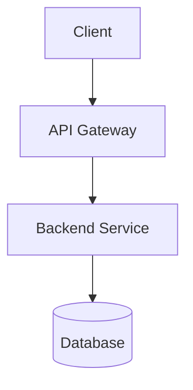
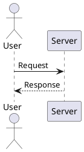

# md-tech-pdf for Visual Studio Code

Export Markdown documents with embedded Mermaid and PlantUML diagrams into clean, high-quality technical PDFs directly inside Visual Studio Code.

## Overview

`md-tech-pdf` is a technical document PDF exporter built specifically for software engineering documents, architecture design records, system specifications, and documentation pipelines.

It renders vector diagrams cleanly, applies modern typography optimized for technical documentation, and provides seamless export actions within VS Code.

A standalone command-line interface (CLI) is also available in the repository for automated CI/CD documentation builds.

## Features

- **Live Print-Preview**: Real-time side-by-side preview matching actual PDF paper dimensions, custom margins, and typography.
- **Synchronized Scrolling (Scroll Sync)**: Accurate two-way scrolling synchronization between the Markdown editor and preview panel, with bidirectional toggle controls, configurable animation modes (`smooth` vs `instant`), and adjustable sync delay (`0ms` to `100ms`).
- **Scroll Position Preservation**: Typing and editing maintains your current scroll location in the preview pane without abrupt resets.
- **Sticky Preview Toolbar**: Keep actions like Export PDF, Refresh, Sync toggle, Scroll Animation (`smooth` / `instant`), Debounce Delay (`0ms` / `20ms` / `50ms` / `100ms`), and Page Zoom (`Fit` / `50%` - `150%`) immediately accessible at the top while scrolling.
- **Fast In-Memory Diagram Cache**: Sub-10ms warm re-rendering for documents with complex Mermaid and PlantUML diagrams.
- **Direct PDF Export**: Convert Markdown files to PDF with a single command.
- **Save As Dialog**: Choose a customized output directory and filename interactively.
- **Explorer Context Menu**: Right-click any `.md` or `.markdown` file in the Explorer view to preview or export.
- **Mermaid Diagram Support**: Render flowcharts, sequence diagrams, class diagrams, state diagrams, and ER diagrams without external dependencies.
- **PlantUML Diagram Support**: Render PlantUML diagrams with local Java and PlantUML JAR integration.
- **Front Matter Configuration**: Control document-level layout, margins, orientations, and custom fonts directly within Markdown.
- **Custom Typography**: Embedded Google Fonts and local font support with refined headings, bold weights, and technical table layouts.
- **Strict Security & CSP**: Isolation through nonce-based Content Security Policy for all preview webview resources.

## Usage

### 1. Open Preview

Open a real-time side-by-side print preview matching target paper dimensions:

1. Open a Markdown file in the editor.
2. Click the **md-tech-pdf: Open Preview** icon in the editor title bar, or open the Command Palette (`Ctrl+Shift+P` / `Cmd+Shift+P`) and run `md-tech-pdf: Open Preview`.
3. The preview panel opens beside your editor, rendering typography and vector diagrams with high-speed in-memory caching.

### 2. Export to PDF

Export the currently active Markdown document directly to a PDF in the same directory:

1. Open a Markdown file in the editor.
2. Open the Command Palette (`Ctrl+Shift+P` or `Cmd+Shift+P`).
3. Run `md-tech-pdf: Export to PDF`.

Output: `document.md` is compiled to `document.pdf`.

### 3. Export to PDF As

Export with a custom destination path and filename:

1. Open a Markdown file in the editor.
2. Open the Command Palette.
3. Run `md-tech-pdf: Export to PDF As...`.
4. Choose the target destination in the Save Dialog.

### 4. Explorer Context Menu

1. In the VS Code File Explorer, right-click on any `.md` or `.markdown` file.
2. Select `md-tech-pdf: Open Preview` or `md-tech-pdf: Export to PDF`.

## Front Matter Configuration

You can customize PDF rendering options and global diagram defaults at the top of your Markdown file using YAML front matter.

Example:

```markdown
---
title: System Architecture Design
pdf:
  format: A4
  landscape: false
  margin:
    top: 20mm
    bottom: 20mm
    left: 20mm
    right: 20mm
diagram:
  width: 140mm
  height: 80mm
  fit: contain
  align: center
style:
  font:
    family: 'Noto Sans JP'
    codeFamily: 'Roboto Mono'
    google:
      families:
        - name: 'Noto Sans JP'
          weights: [400, 700]
        - name: 'Roboto Mono'
          weights: [400, 700]
  css:
    - ./custom-theme.css
---

# 1. System Overview

This document demonstrates high-quality PDF export using `md-tech-pdf`.
```

## Diagram Sizing and Positioning

`md-tech-pdf` gives you precise control over how Mermaid and PlantUML diagrams are sized and aligned in both print preview and exported PDFs.

### Global Diagram Settings (Front Matter)

Set document-wide defaults for all diagrams under the `diagram` front matter section:

- `width`: Default diagram container width (supported units: `mm`, `cm`, `in`, `px`, `pt`, `%`).
- `height`: Default diagram container height (supported units: `mm`, `cm`, `in`, `px`, `pt`, `%`).
- `fit`: Scaling behavior:
  - `contain` (default): Preserves aspect ratio while fitting within container dimensions.
  - `fill`: Stretches the diagram SVG to fill the specified width and height.
- `align`: Horizontal positioning (`center` [default], `left`, or `right`).

### Per-Diagram Block Attributes

Override defaults for individual diagram blocks using curly brace attributes `{...}` following the code fence language:

````markdown

````

PlantUML diagrams support the identical syntax:

````markdown

````

## Requirements

- **Mermaid**: Bundled within the extension. No extra runtime or installation is required.
- **PlantUML**: Requires a local Java runtime (Java 8+) and a PlantUML JAR file. Specify their paths in Settings if they are not in your default system PATH.
- **Network**: Required only when downloading external Google Fonts during export.

## Configuration

Configure extension settings via VS Code Settings (`Preferences: Open User Settings (JSON)` or GUI):

- `md-tech-pdf.preview.refresh`: Controls when an open preview is refreshed (`"manual"`, `"onSave"`, or `"onType"`, default: `"onSave"`).
- `md-tech-pdf.preview.debounceDelay`: Debounce delay in milliseconds before refreshing the preview on typing edits when `preview.refresh` is `"onType"` (minimum: `100`, default: `500`).
- `md-tech-pdf.preview.scrollSync.enabled`: Default scroll synchronization state (`true` or `false`, default: `true`).
- `md-tech-pdf.preview.scrollSync.behavior`: Default scroll animation behavior (`"smooth"` or `"instant"`, default: `"smooth"`).
- `md-tech-pdf.preview.scrollSync.delay`: Default editor-to-preview scroll sync debounce delay in milliseconds (`0`, `20`, `50`, or `100`, default: `50`).
- `md-tech-pdf.preview.zoom`: Default preview zoom scale (`"fit"`, `"50%"`, `"75%"`, `"100%"`, `"125%"`, or `"150%"`, default: `"fit"`).
- `md-tech-pdf.preview.cache.persistent`: Enable persistent disk caching for rendered Mermaid and PlantUML diagrams across VS Code sessions (default: `true`).
- `md-tech-pdf.styles`: List of custom CSS file paths (relative to workspace or document) to apply to preview and PDF export (default: `[]`).
- `md-tech-pdf.plantuml.javaPath`: Path to the Java executable (default: `"java"`).
- `md-tech-pdf.plantuml.jarPath`: Path to the local `plantuml.jar` file (default: `""`).
- `md-tech-pdf.export.outputDirectory`: Default output directory for exports. Leave empty to output next to the source Markdown file (default: `""`).
- `md-tech-pdf.export.afterExport`: Action to perform automatically after export: `"none"`, `"open"` (open in editor), or `"reveal"` (reveal in OS file manager) (default: `"none"`).

## Known Limitations

- Very large diagrams may push following content to a new page or leave white space if they exceed page dimensions.
- PlantUML requires Java and a valid `plantuml.jar` installed on your machine.
- Google Fonts fetching requires an active internet connection during rendering.

## License

Apache License 2.0. See [LICENSE](LICENSE) for details.

## Repository

Source code and issue tracker: <https://github.com/ikaruga-tech/md-tech-pdf>
